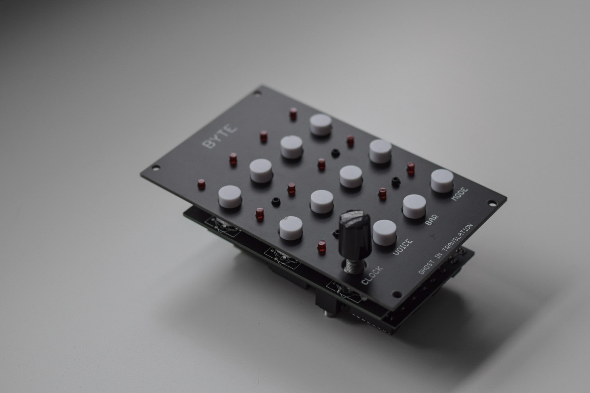
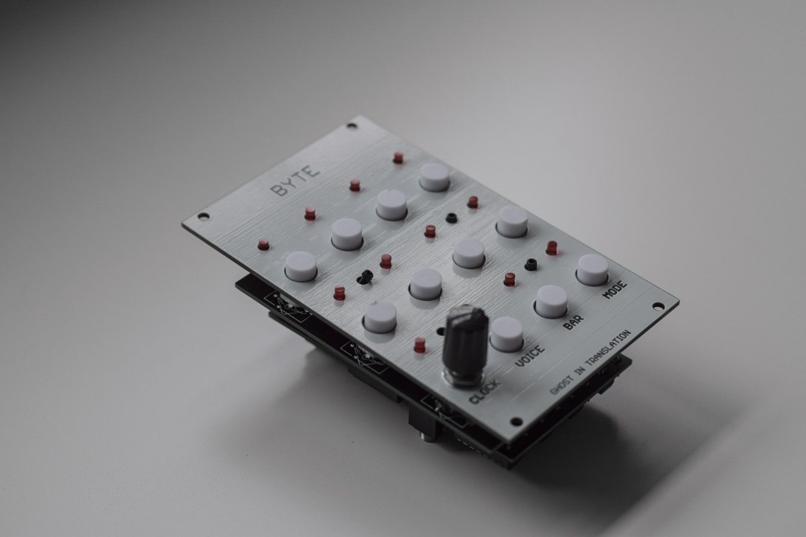

# BYTE


BYTE is a modular drum sequencer, based on eurorack physical format it has however no patch cables in the front but has rather midi jacks in the back.

It is based on [Motherboard](https://github.com/ghostintranslation/motherboard), my modular platform, see in there for schematics.

You can get the PCBs and front panel here:<br/>
https://ghostintranslation.bandcamp.com/merch/byte-panel-and-pcb

 

## Features

* 8 steps
* 8 bars
* 8 voices
* Sequencer, Trigger, Mixer modes
* MIDI over USB
* MIDI over mini jack

## Dimensions

Height: 3U / 128.5mm

Width: 16HP / 80mm

## Getting Started

### Prerequisites

What things you need to make it work:

```
1 Teensy 4.0
1 MOTHERBOARD12A pcb
1 MOTHERBOARD12B pcb
1 BYTE front panel pcb
11 D6 push buttons
1 vertical rotary encoder
3 14 pins male header
5 14 pins female header
1 5 pins female header
1 5 pins female headers
4 M2 8mm nylon standoff + screws + nuts *
6 CD4051 multiplexers
6 DIP16 IC sockets (optional)
2 3.5mm jack connectors
1 resistor ~ 22ohm
12 LED
1 4 positions dipswitch (optional)
```

Here is a list of useful links to get these parts: https://github.com/ghostintranslation/parts

Note: 
- The resistor doesn't need to be high because the multiplexers already are resistive, so try a few values. You can place the resistor and LEDs without soldering to test, there should be enough contact.
- The dipswitch is optional, without it the module will listen to channel 1.
- I tested M2 standoffs but M3 should fit too

### Assembly

1. Solder male 14 pins headers on the audio board
2. Solder 14 pins long female header and 5 pins male header on Teensy
3. Solder 14 pins male headers on MOTHERBOARD12A
4. Place the buttons, rotary encoder and LEDs on MOTHERBOARD12A, and attach the front panel
5. Solder the buttons, rotary encoder and the LEDs
6. Place the 14 pins and 5 pins female headers for the Teensy on MOTHERBOARD12B, insert the Teensy on them, then solder the headers
7. Detach the Teensy for now
8. Solder the jack connectors, the dipswitch and the resistor on MOTHERBOARD12B
9. Place 14 pins female headers on MOTHERBOARD12B, connect MOTHERBOARD12A on them, then solder the headers
10. Detach the boards for now
11. Solder IC sockets on IC1, IC2, IC5, IC6, IC7 and IC8 positions on MOTHERBOARD12B
12. Add the multiplexers on the sockets, connect the 2 boards and connect the Teensy and audio board

Note: Be careful how you place the buttons and rotary encoder:


### Firmware

In order to run any sketch on the Teensy you have to install Arduino and the Teensyduino add-on.
Follow the instructions from the official page:
https://www.pjrc.com/teensy/teensyduino.html

1. Then open `Byte.ino` located in the `Byte` folder of this repo.
2. In the Tools -> USB Type menu, choose `Serial + midi`.
3. Plug the Teensy to your computer with a micro USB cable. (It's ok if the Teensy is on the module)
4. Then just click the arrow button to upload the code

## How to use

```
Default screen
    - Each pair of LED-Button represent a step within the current Voice and Bar.
    - The LED indicates when the step is active.
    - The button toggles the step.

Clock
    - Usage
        - A long press on the Clock rotary will enter the Clock mode screen.
        - Turn the rotary while in this mode to select between Follower and Leader modes.
        - Press to validate and exit
    - Display
        - Leader is a slow blink, Follower is a fast blink
    - Modes
        1. Leader
            - Sends MIDI clock and song position messages
            - Turn the rotary to increments or decrements the tempo
            - Press to toggle Play/Stop
        2. Follower
            - Synchronize its steps to the received clocks and song position messages
            - Turn the rotary to choose between 8 values to divide the received clock   (TODO)
            - Press to toggle Play/Stop

Voice
    - Usage
        - Press once the Voice button to enter the Voice screen.
        - Press any of the 8 steps buttons to change the Voice.
    - Display
        - The selected voice is indicated by a blinking LED.
        - Screen stays 2 seconds or until selection.

Bar
    - Usage
        - Press once the Bar button to enter the Bar screen.
        - Press any of the 8 steps buttons to change the Bar.
    - Display
        - The selected scale is indicated by a blinking LED.
        - Screen stays 2 seconds or until selection.

Mode
    - Usage
        - Press once the Mode button to enter the Mode screen.
        - Press again the button while in this screen to change the Mode.
        - Choose between 3 modes.
    - Display
        - The selected mode is indicated by a blinking LED.
        - Screen stays 1s after last press.
    - Modes
        1. Sequencer
            - Default screen
            - Use the buttons to toggle the steps
            - Use Voice and Bar to select the current voice and bar
        2. Trigger
            - Use the buttons to trigger each voice
            - Voice and Bar buttons are disabled
        3. Mixer
            - Use the buttons to toggle each voice
            - Voice and Bar buttons are disabled

```

The Clock input is available via MIDI CC.

## MIDI

BYTE supports MIDI in and out via USB and TS jack. It sends out MIDI notes and clock/start/stop/song position messages.

The MIDI in default settings are:
```
CC 0 = Clock (tempo)
```

These settings can be changed in the code or via the web editor: http://ghostintranslation.com/editor

**Important:**

The MIDI input and output jacks are directly connected to the Teensy serial input and output. That means there is not protection against voltage or current. It is primarily ment to connect 2 of these modules, or 2 Teensy together. If you want to connect something else to it make sure to provide a maximum of 3.3v and 250 mA.

## TODO
* Improve midi clock sync
* Finish the Following clock mode
* Save current state and reload on power off/on

## About me
You can find me on Bandcamp, Instagram, Youtube and my own site:

https://ghostintranslation.bandcamp.com/

https://www.instagram.com/ghostintranslation/

https://www.youtube.com/channel/UCcyUTGTM-hGLIz4194Inxyw

https://www.ghostintranslation.com/

## Support
To support my work:<br>
https://www.paypal.com/paypalme/ghostintranslation

## License

This project is licensed under the MIT License - see the [LICENSE.md](LICENSE.md) file for details